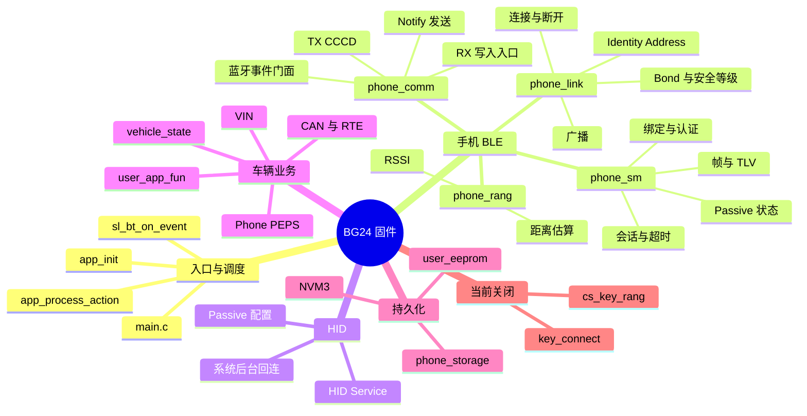
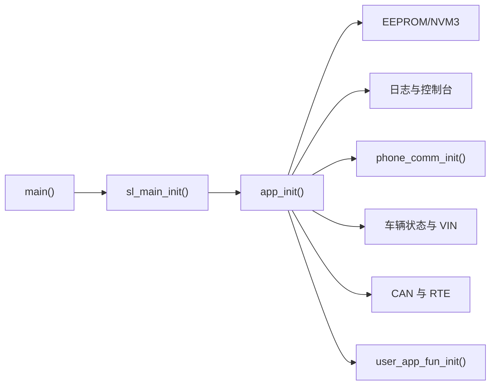
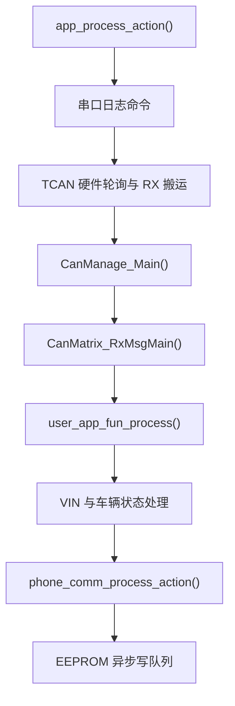
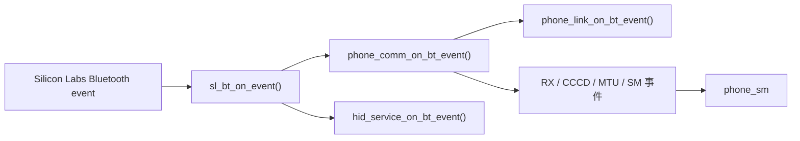
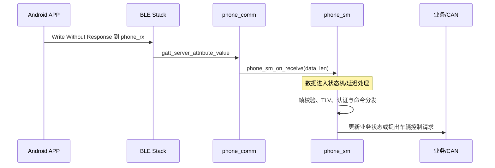
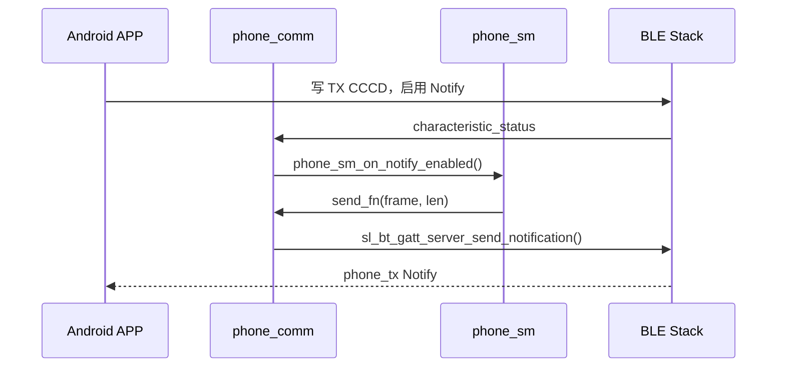

# BG24 固件新人接入与 BLE/GATT 阅读指南

> 适用对象：首次接触本工程的固件开发、APP 联调和测试人员。  
> 目标：先建立正确的运行模型，再沿真实场景阅读代码；本文不是正式协议，也不替代测试记录。  
> 基线日期：2026-08-20。

## 1. 先记住这五件事

1. 工程目标芯片是 `EFR32BG24B110F1536IM48`，配置的 Silicon Labs SDK 是 `2025.6.0`，工程入口为 `bt_cs_soc_initiator.slcp`。
2. 当前工程配置未包含 Kernel 组件，程序走无 RTOS 的 super loop 分支：`main()` 初始化后持续执行 Silicon Labs 组件处理和 `app_process_action()`；蓝牙事件另由 `sl_bt_on_event()` 分发。
3. 当前 `APP_KEY_ENABLE=0`。手机 BLE、HID、CAN 桥接、车辆状态、VIN 和 NVM 路径处于当前运行路径；`key_connect/` 和 `cs_key_rang/` 源码存在，但钥匙 Central/CS 业务路径被条件编译关闭。
4. 手机链路中，BG24 是 BLE Peripheral，同时是 GATT Server；手机通常是 BLE Central 和 GATT Client。
5. 当前自定义 RX 特征仅配置 `Write Without Response`，TX 特征配置 `Notify`。手机必须订阅 TX 的 CCCD，业务回包才能通过 Notify 到达 APP。

## 2. 本文怎样使用

不要从目录第一项开始顺序读完整仓库。推荐按照下面三轮阅读：

| 轮次 | 目标 | 只回答的问题 | 建议时间 |
|---|---|---|---:|
| 第一轮 | 建立全局 | 程序从哪里启动？主循环做什么？蓝牙事件进哪里？ | 30 分钟 |
| 第二轮 | 走通手机收发 | APP 写入后经过哪些函数？BG24 怎样 Notify 回包？ | 60 分钟 |
| 第三轮 | 深入业务 | 帧、TLV、认证、Bond、HID、CAN/PEPS 怎样协作？ | 按任务选择 |

阅读时给每个函数只做一种标记：

- `入口`：由主循环、蓝牙事件或外设事件直接调用；
- `状态`：保存连接、认证、绑定、车辆或 NVM 状态；
- `转换`：把 GATT 字节转换为帧、TLV 或业务动作；
- `出口`：发送 Notify、写入 CAN RTE、NVM 或输出日志。

如果一个函数暂时无法归类，先记录调用者和被调用者，不要立即钻进所有实现细节。

## 3. 工程事实与当前启用范围

### 3.1 工具与目标

| 项目 | 当前证据 | 状态 |
|---|---|---|
| 工程入口 | [`bt_cs_soc_initiator.slcp`](../bt_cs_soc_initiator.slcp) | 已确认 |
| 目标器件 | `EFR32BG24B110F1536IM48`，来自 `.slcp` | 已确认 |
| SDK | `simplicity_sdk 2025.6.0`，来自 `.slcp` | 已确认 |
| 工具链组件 | `.slcp` 包含 `toolchain_gcc` | 已确认已配置 |
| IDE 使用方式 | Simplicity Studio 打开 `.slcp`，来自 [`README.md`](../README.md) | 已确认文档入口 |
| 命令行构建方式 | 仓库内没有可确认的统一命令 | 待补充 |
| 实物板、调试器、串口参数、CAN 接线 | 当前本文检查范围内没有形成完整清单 | 待补充 |
| 本次构建与实机验证 | 本文只做静态阅读 | 未执行 |

### 3.2 模块接入状态

“源码存在”“工程配置包含”和“当前运行路径实际到达”不是一回事。

| 模块 | 源码存在 | 当前运行路径 | 证据与说明 |
|---|---|---|---|
| `main.c` / `app.c` | 是 | 已连接 | `main()` 调用 `app_init()` 和 `app_process_action()` |
| `user_phone/` | 是 | 已连接 | `app_init()` 调用 `phone_comm_init()`；主循环和蓝牙事件均进入该模块 |
| `user_hid/` | 是 | 已连接 | `sl_bt_on_event()` 调用 `hid_service_on_bt_event()`；运行模式还受配置、Bond 和 Passive 状态约束 |
| `user_app_fun/` | 是 | 已连接 | 初始化和主循环均调用，负责 CAN 与 BLE/PEPS 衔接 |
| `user_can_common/`、`user_can_driver/` | 是 | 已连接 | `app_init()` 初始化；`app_process_action()` 轮询和调度 |
| `user_eeprom/` | 是 | 已连接 | 上电预加载；主循环每轮处理一个异步写任务 |
| `user_vehicle_state.c`、`user_vin.c` | 是 | 已连接 | 初始化和主循环均调用 |
| `key_connect/`、`cs_key_rang/` | 是 | 当前关闭 | `config/app_config.h` 中 `APP_KEY_ENABLE=0`，相关调用被条件编译排除 |
| `autogen/` | 是 | 由工程生成并使用 | 生成区，不应作为业务修改入口 |
| `simplicity_sdk_2025.6.0/` | 是 | SDK 依赖 | 供应商代码，不是新人首读区 |

## 4. 代码全局地图



### 4.1 启动路径



建议按 [`main.c`](../main.c) → [`app.c`](../app.c) 的顺序阅读。`app_init()` 中当前主要初始化顺序是：

1. 注册 NVM3 驱动并加载 EEPROM 数据；
2. 初始化日志和串口命令入口；
3. 初始化手机通信 `phone_comm_init()`；
4. 从 EEPROM 恢复 HID 调试 PIN；
5. 初始化车辆状态和 VIN；
6. 初始化电压、SysTick/CAN RTE、CAN Matrix；
7. 初始化 CAN ↔ BLE 应用桥接。

### 4.2 主循环路径



`phone_comm_process_action()` 内部继续执行：

```text
phone_link_process_action()
  -> phone_sm_process_action()
  -> phone_rang_process_action()
```

这说明协议接收回调并不等于所有业务都在蓝牙事件上下文立即完成。`phone_sm_on_receive()` 会把数据交给状态机，部分解析、加密和延迟任务在后续主循环中处理。

### 4.3 蓝牙事件入口



当前 `APP_KEY_ENABLE=0` 时，手机通信和 HID 会接收蓝牙事件。启用钥匙功能后，`app.c` 还会根据连接角色和事件类型，在 Central 钥匙链路与 Peripheral 手机链路之间做事件隔离。

## 5. BLE 基础：只学本项目马上会用到的部分

### 5.1 GAP、ATT、GATT 分别解决什么

| 层次 | 它解决的问题 | 本项目对应位置 |
|---|---|---|
| GAP | 设备怎样广播、被发现、建立连接，以及双方连接角色 | `user_phone/link/phone_link.c` |
| ATT | 连接上怎样按“属性”读写数据；MTU 也属于该层的重要参数 | Silicon Labs Bluetooth Stack 事件和 API |
| GATT | 怎样把属性组织为 Service、Characteristic、Descriptor | `config/btconf/gatt_configuration.btconf` |
| APP 协议 | 特征值中的字节怎样组成帧、TLV、认证和业务命令 | `user_phone/data/` 与 APP 协议文档 |

蓝牙连接成功只表示有一条物理 BLE 链路，不表示已经完成服务发现、CCCD 订阅或业务认证。

### 5.2 BLE 角色与 GATT 角色

在手机连接场景中：

| 角色维度 | BG24 | 手机 |
|---|---|---|
| GAP 连接角色 | Peripheral | Central |
| GATT 数据角色 | Server | Client |
| 自定义业务 RX | 接收手机写入 | 执行 Write Without Response |
| 自定义业务 TX | 发送 Notify | 订阅并接收 Notify |

GAP 角色和 GATT 角色是两个概念。代码中的 `sl_bt_connection_role_peripheral` 用来识别“手机连到 BG24”的连接角色；`gattdb_phone_rx`、`gattdb_phone_tx` 则属于 GATT Server 数据库。

### 5.3 Service、Characteristic、Descriptor

- **Service**：一组相关能力的容器，例如 HID Service 或本项目自定义通信 Service。
- **Characteristic**：具体的数据通道，包含 Value 和允许的操作属性。
- **Descriptor**：补充描述特征值的元数据。最重要的是 CCCD，用于由客户端开启或关闭 Notify/Indicate。
- **UUID**：Service、Characteristic、Descriptor 的身份。标准蓝牙能力常用 16-bit UUID，自定义能力通常使用 128-bit UUID。

当前自定义 GATT 定义：

| 对象 | UUID | 当前属性 | 数据方向 |
|---|---|---|---|
| Custom Service | `A5A50001-1234-5678-ABCD-1234567890AB` | Primary Service | 容纳 APP 通信通道 |
| `phone_rx` | `A5A50002-1234-5678-ABCD-1234567890AB` | `write_no_response` | APP → BG24 |
| `phone_tx` | `A5A50003-1234-5678-ABCD-1234567890AB` | `notify` | BG24 → APP |

GATT 源文件是 [`config/btconf/gatt_configuration.btconf`](../config/btconf/gatt_configuration.btconf)。`autogen/gatt_db.c` 和 `autogen/gatt_db.h` 是生成结果；需要改变 GATT 时，应先确认设计，再修改源配置并按 Simplicity Studio 流程重新生成，不要只改 `autogen/`。

### 5.4 Write With Response 与 Write Without Response

| 方式 | ATT 层结果 | 常见特性 |
|---|---|---|
| Write Request / Write With Response | Server 返回 ATT Write Response | 客户端知道该次 ATT 写请求是否被协议栈接受 |
| Write Command / Write Without Response | ATT 层不返回 Write Response | 开销较低；业务成功与否需要由上层协议确认 |

本项目当前正式代码事实：`phone_rx` **只配置了 `write_no_response`**。因此对接当前固件时，APP 应使用 Write Without Response。BG24 随后的业务 Response 是通过 `phone_tx` Notify 发送的，它不是 ATT Write Response。

协议文档与该属性存在已记录差异；最终选择“修改 GATT”还是“修订协议”尚未在本指南中决定。不要仅凭协议文字让 APP 改用 Write With Response。

### 5.5 Notify、Indicate 与 CCCD

| 方式 | 特点 | 当前自定义 TX 是否使用 |
|---|---|---|
| Notify | Server 主动发送；ATT 层没有客户端确认 | 是 |
| Indicate | Server 主动发送；客户端返回 ATT 确认 | 否 |

Notify 特征存在并不等于已经可以发送。APP 完成服务发现后，需要对 TX 的 CCCD 写入 Notify 使能值。代码通过 `sl_bt_evt_gatt_server_characteristic_status` 观察该状态，并在成功后调用 `phone_sm_on_notify_enabled()`。

在日志中重点观察：

```text
[PHONE] TX CCCD ENABLED
```

连接存在但没有这条状态时，应先检查 APP 是否完成服务发现和订阅，而不是直接怀疑业务帧解析。

### 5.6 ATT MTU 与业务帧长度

ATT MTU 是一次 ATT PDU 能承载的最大长度。Write/Notify 的特征值可用空间通常还要扣除 ATT 操作码和 Handle，业务协议又要扣除自己的帧头、计数器、认证标签和 CRC。

本项目代码定义了：

- 目标 MTU：`PHONE_MTU_TARGET=247`；
- 绑定/换绑最低 MTU：`PHONE_MTU_MIN_BIND=219`；
- 控制/状态最低 MTU：`PHONE_MTU_MIN_CONTROL=194`；
- GATT 生成数据库中 RX/TX 特征最大长度为 255 Byte。

“特征最大长度 255”不代表任意 255 Byte 都能在一次实际写入或 Notify 中完成。运行时应以协商后的 MTU 和项目帧限制为准。协议中的最大 token、单帧和 MTU 关系仍有待确认项，详见 [`APP_PROTOCOL_CODE_CONFLICT_REVIEW.md`](APP协议/APP_PROTOCOL_CODE_CONFLICT_REVIEW.md) 的 C-011。

### 5.7 四种容易混淆的安全状态

| 状态 | 含义 | 不能替代什么 |
|---|---|---|
| BLE Connected | 已建立物理连接 | 不等于 Bond、加密或业务认证 |
| BLE Encrypted | 当前链路已加密 | 不等于业务身份已绑定 |
| Android Bond | 系统保存了 BLE 长期密钥，可支持后台回连 | 不等于 APP 业务绑定仍有效 |
| APP Business Auth | `phone_sm` 已按业务协议验证身份并建立会话 | 不等于 Android 一定仍保存 Bond |

`phone_link_init()` 配置 BLE Security Manager，并默认关闭 Bondable；特定 Passive 配对流程会临时切换配对能力。自定义 RX/TX 的 GATT 权限当前没有直接要求 encrypted/authenticated，敏感业务的安全性主要还依赖 `phone_sm` 的帧认证、会话、计数器和业务准入。

## 6. 手机数据从 GATT 到业务的真实路径

### 6.1 APP 写入 BG24



关键代码：

- [`user_phone/phone_comm.c`](../user_phone/phone_comm.c)：匹配 `gattdb_phone_rx`，调用 `phone_sm_on_receive()`；
- [`user_phone/data/phone_frame.c`](../user_phone/data/phone_frame.c)：帧编解码和 CRC；
- [`user_phone/data/phone_tlv.c`](../user_phone/data/phone_tlv.c)：TLV 编解码；
- [`user_phone/data/phone_sm.c`](../user_phone/data/phone_sm.c)：状态、认证、命令和超时；
- [`user_app_fun/user_app_fun.c`](../user_app_fun/user_app_fun.c)：业务状态与 CAN/RTE 桥接。

### 6.2 BG24 Notify APP



`phone_sm_init()` 接收 `phone_comm_notify_send` 作为发送回调。状态机生成完整业务帧后，不直接依赖 GATT Handle，而是通过该回调由 `phone_comm` 使用当前连接句柄和 `gattdb_phone_tx` 发送。

## 7. 八张场景卡片

### 场景 1：上电并开始广播

| 项目 | 内容 |
|---|---|
| 触发 | Bluetooth Stack 发出 `sl_bt_evt_system_boot` |
| 入口 | `sl_bt_on_event()` → `phone_comm_on_bt_event()` |
| 经过 | `phone_sm_on_system_boot()` 先恢复/校验 Passive 与授权 Bond；随后 `phone_link_on_bt_event()` 创建 advertiser 并启动广播 |
| 关注状态 | 稳定 Identity Address、绑定状态、Passive 状态、广播数据 |
| 建议观察 | `[PHONE]` 启动、安全配置和 advertiser 日志 |

### 场景 2：手机建立物理 BLE 连接

| 项目 | 内容 |
|---|---|
| 触发 | `sl_bt_evt_connection_opened`，角色为 Peripheral |
| 入口 | `phone_link_on_bt_event()` |
| 经过 | 保存 connection handle 和 bonding handle → `phone_sm_on_connection_opened()` → 停止当前广播 |
| 关注状态 | Connected 只证明物理连接存在 |
| 建议观察 | `LINK_SECURITY OPEN`、`CONNECTED`、`Advertising stopped (connected)` |

### 场景 3：APP 发现服务并订阅 TX

| 项目 | 内容 |
|---|---|
| 触发 | APP 写入 `phone_tx` 的 CCCD |
| 入口 | `sl_bt_evt_gatt_server_characteristic_status` |
| 经过 | `phone_comm_on_bt_event()` → `phone_sm_on_notify_enabled()` |
| 关注状态 | Notify 是否真正使能 |
| 建议观察 | `[PHONE] TX CCCD ENABLED` |

### 场景 4：APP 写入一条业务帧

| 项目 | 内容 |
|---|---|
| 触发 | APP 对 `phone_rx` 执行 Write Without Response |
| 入口 | `sl_bt_evt_gatt_server_attribute_value` |
| 经过 | `phone_comm_on_bt_event()` → `phone_sm_on_receive()` → 后续主循环处理 |
| 关注状态 | 写入方式、帧长度、Magic/Version、CRC、TLV 和当前会话 |
| 建议观察 | 开启帧日志时的 `[GATT] RX_RAW` 与 `[SM]` 日志；日志可能包含敏感材料，不能直接用于量产 |

### 场景 5：BG24 返回业务结果

| 项目 | 内容 |
|---|---|
| 触发 | `phone_sm` 完成命令处理并生成 Response/Event |
| 入口 | 状态机保存的发送回调 |
| 经过 | `phone_comm_notify_send()` → `sl_bt_gatt_server_send_notification()` → `phone_tx` |
| 关注状态 | 连接句柄有效、CCCD 已使能、业务层 Response 与 ATT 写响应不是一回事 |
| 建议观察 | APP 的 TX Notify 回调和 BG24 的 `[SM]` 发送日志 |

### 场景 6：协商 MTU

| 项目 | 内容 |
|---|---|
| 触发 | `sl_bt_evt_gatt_mtu_exchanged` |
| 入口 | `phone_comm_on_bt_event()` |
| 经过 | `phone_sm_on_mtu_exchanged(mtu)` 更新会话 MTU |
| 关注状态 | 某些绑定或控制命令有最低 MTU 准入条件 |
| 建议观察 | `[SM] MTU=<value>`；APP 侧同步记录实际协商值 |

### 场景 7：系统 Bond 与业务认证协作

| 项目 | 内容 |
|---|---|
| 触发 | 业务配对流程以及 `sm_confirm_bonding`、`sm_bonded`、`sm_bonding_failed` 事件 |
| 入口 | `phone_comm_on_bt_event()` 和 `phone_link_on_bt_event()` |
| 经过 | Link 层维护 Bond/安全等级事实；`phone_sm` 决定是否授权、提交或清理授权 Bond |
| 关注状态 | Android Bond、授权 Bond 记录、APP 绑定和业务会话必须分别判断 |
| 建议观察 | `LINK_SECURITY`、`SM_BONDED`、授权 Bond 相关 `[SM]` 日志 |

### 场景 8：HID 后台连接后打开 APP

| 项目 | 内容 |
|---|---|
| 触发 | Android 因 HID/Bond 已持有与 BG24 的物理连接，用户随后打开 APP |
| APP 动作 | 按稳定 Identity Address 直接发起 GATT 访问，重新完成服务发现和 TX CCCD 订阅；扫描只作为地址未知或直连失败后的兜底 |
| 固件现象 | 可能没有新的 `connection_opened`，但会出现新的 CCCD 订阅和业务认证过程 |
| 关注状态 | HID 连接、系统 Bond、APP 业务认证是不同状态；设备已连接时停止广播并不代表离线 |
| 参考 | [`APP_BACKGROUND_GATT_CONNECTION_ANALYSIS.md`](APP_BACKGROUND_GATT_CONNECTION_ANALYSIS.md) |

## 8. 业务协议应该怎样读

先按层阅读，不要直接从 `phone_sm.c` 的所有命令分支开始：

```text
GATT 特征值
  -> phone_frame：帧头、Payload、Counter、Tag、CRC
  -> phone_tlv：Payload 字段
  -> phone_session：会话、计数器和安全状态
  -> phone_sm：命令准入、认证、超时和响应
  -> phone_storage：绑定、授权 Bond 和配置持久化
  -> user_app_fun：车辆状态、CAN 和 PEPS 动作
```

当前帧层的基础事实可从 [`user_phone/phone_cfg.h`](../user_phone/phone_cfg.h) 和 [`user_phone/data/phone_frame.h`](../user_phone/data/phone_frame.h) 开始：

- Magic：`0xA5`；
- Version：`0x11`；
- 固定帧头：11 Byte；
- 消息类型：Request、Response、Event；
- 明文和加密帧均带 CRC；
- 加密帧另外包含 Security Counter 和认证 Tag；
- V1.1 当前按单分片字段处理。

协议与代码差异统一记录在 [`APP_PROTOCOL_CODE_CONFLICT_REVIEW.md`](APP协议/APP_PROTOCOL_CODE_CONFLICT_REVIEW.md)。使用规则是：

- 只有 C-001 已确认：当前 GATT RX 只配置 `write_no_response`；
- C-002～C-022 都不能直接写成代码缺陷或正式协议结论；
- 负责人逐项确认前，不依据清单修改 GATT、协议、NVM、CAN 或安全逻辑。

## 9. 新人第一天建议完成的闭环

### 9.1 环境闭环

1. 使用 Simplicity Studio 打开 [`bt_cs_soc_initiator.slcp`](../bt_cs_soc_initiator.slcp)。
2. 确认使用匹配的 SDK 2025.6.0 和 GCC 工具链组件。
3. 在项目现有配置下完成构建和烧录。
4. 连接 VCOM，确认能够看到 `[PHONE]`、`[SM]`、`[APP_FUN]` 等启动日志。

本文没有执行构建或烧录；实际板卡型号、调试器、串口参数和 CAN 接线应由项目负责人补充后再作为新人统一操作基线。

### 9.2 BLE 最小闭环

按下面顺序逐步验证，每一步失败时不要跳到后面的业务认证：

```text
看到广播
  -> 建立 BLE 连接
  -> 发现 Custom Service
  -> 找到 phone_rx / phone_tx
  -> 订阅 phone_tx CCCD
  -> 使用 Write Without Response 写入合法请求
  -> 收到 phone_tx Notify
  -> 再验证绑定、认证和车辆业务
```

### 9.3 建议先观察的只读串口命令

以下命令从当前代码看主要用于显示状态，但仍应只在开发板和允许的调试环境中使用：

| 命令 | 用途 |
|---|---|
| `hid_status` | 查看 HID 运行、连接和 Bond 状态 |
| `phone_did` | 查看当前 deviceId |
| `phone_rang` | 查看手机 RSSI 与距离估算状态 |
| `phone_zone` | 查看 Phone PEPS 区域和阈值 |
| `can_status` | 查看 CAN/RTE 中 Key/Phone 状态 |
| `can_nm_status` | 查看 CAN NM/CanManage 状态 |
| `vin_show` | 查看 VIN 和 VIN 抽象状态 |

不要在不了解后果时执行会修改 NVM、安全材料、Bond 或车辆动作的命令，例如：`phone_unbind`、`hid_cfg`、`hid_pin`、`phone_qid`、`phone_cv`、`phone_bind_secret`、`phone_factory_pubkey`、`can_cmd`。执行前应保存测试前状态并确认恢复方法。

## 10. 常见误区与排查入口

| 现象或误区 | 先检查什么 |
|---|---|
| “连接成功，所以协议应该能用了” | 是否完成服务发现、TX CCCD 和业务认证 |
| “APP 写成功，所以车辆控制成功” | Write Without Response 只表示客户端已发出；还要检查业务 Notify 和车辆结果闭环 |
| “扫不到广播，所以设备离线” | Android/HID 是否已经占用物理连接；是否可以按稳定地址直连 |
| “有 Bond，所以 APP 已登录” | Android Bond、授权 Bond 记录、APP 业务认证是否分别成立 |
| “特征长度 255，所以能一次写 255 Byte” | 实际 ATT MTU、ATT 开销和业务帧开销 |
| “改 `autogen/gatt_db.c` 就能改 GATT” | 应修改 `config/btconf/gatt_configuration.btconf` 并重新生成 |
| “仓库里有 CS 代码，所以当前正在测距” | `APP_KEY_ENABLE=0`，钥匙 Central/CS 主路径当前关闭 |
| “先读 SDK 才能理解项目” | 先读 `main.c`、`app.c`、`user_phone/` 和 GATT 配置；遇到底层 API 再查 SDK |

## 11. 推荐阅读顺序

### 必读：建立当前运行模型

1. [`README.md`](../README.md)
2. [`main.c`](../main.c)
3. [`app.c`](../app.c)
4. [`config/app_config.h`](../config/app_config.h)
5. [`user_phone/phone_comm.c`](../user_phone/phone_comm.c)
6. [`user_phone/link/phone_link.c`](../user_phone/link/phone_link.c)
7. [`config/btconf/gatt_configuration.btconf`](../config/btconf/gatt_configuration.btconf)

### 按手机协议场景深入

1. [`user_phone/phone_cfg.h`](../user_phone/phone_cfg.h)
2. [`user_phone/data/phone_frame.c`](../user_phone/data/phone_frame.c)
3. [`user_phone/data/phone_tlv.c`](../user_phone/data/phone_tlv.c)
4. [`user_phone/data/phone_session.c`](../user_phone/data/phone_session.c)
5. [`user_phone/data/phone_sm.c`](../user_phone/data/phone_sm.c)
6. [`user_phone/data/phone_storage.c`](../user_phone/data/phone_storage.c)

### 按车辆联动场景深入

1. [`user_app_fun/user_app_fun.c`](../user_app_fun/user_app_fun.c)
2. [`user_app_fun/user_app_phone_peps.c`](../user_app_fun/user_app_phone_peps.c)
3. [`user_vehicle_state.c`](../user_vehicle_state.c)
4. [`user_vin.c`](../user_vin.c)
5. `user_can_common/CanMatrix/`、`user_can_common/Rte*` 和 `user_can_driver/`

### 暂缓阅读

- `simplicity_sdk_2025.6.0/`：只在需要确认 Silicon Labs API 行为时进入；
- `autogen/`：用于理解生成结果，不作为业务修改入口；
- `GNU ARM v12.2.1 - Default/`：构建输出，不作为源码阅读入口；
- `key_connect/`、`cs_key_rang/`：只有任务明确涉及开启 `APP_KEY_ENABLE` 时再系统阅读。

## 12. 新人交接时还需要补齐的信息

以下内容无法仅从当前代码安全推断，建议由项目负责人补充：

- 实物板版本、调试器、供电和 VCOM 串口参数；
- TCAN4550 与整车/台架的实际接线和终端电阻要求；
- 标准构建配置名称、烧录步骤、固件版本命名和发布物位置；
- APP 测试工具、测试账号/密钥、测试车辆身份和数据清理流程；
- APP 协议文档的批准状态、适用版本和最终负责人；
- 可执行的冒烟测试、回归测试及预期日志；
- 哪些串口调试命令允许在量产固件中保留。

## 13. 文档维护规则

发生以下任一变化时，应同步更新本文：

- `.slcp` 的器件、SDK、工具链或 Bluetooth 组件发生变化；
- `APP_KEY_ENABLE` 或其他主功能开关改变；
- `app_init()`、`app_process_action()` 或 `sl_bt_on_event()` 的主路径改变；
- 自定义 Service/Characteristic UUID、属性或安全权限改变；
- APP 协议、帧格式、MTU、绑定/认证或 Passive 流程正式变更；
- 新增统一构建、烧录、硬件接线或测试流程。

本文描述的是静态代码可见的当前结构，不证明固件已在目标硬件上成功运行。构建、烧录和实机结果应以对应验证记录为准。
